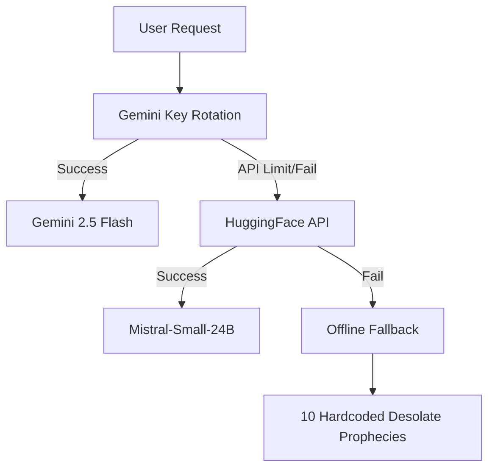
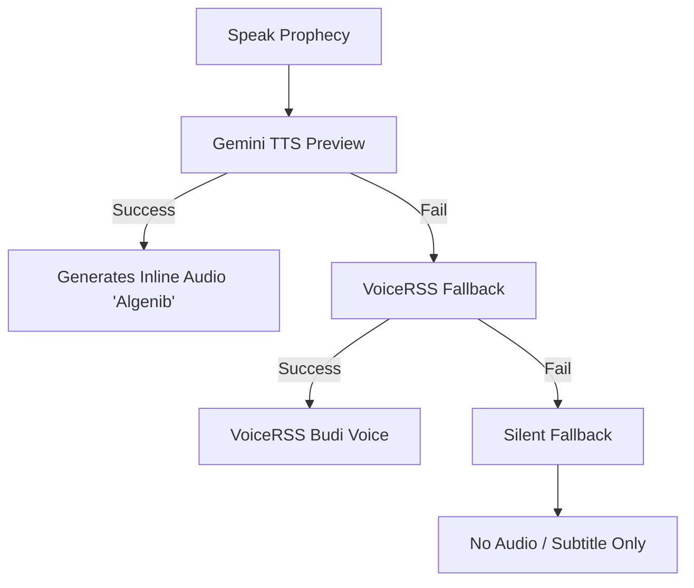

# 🔮 MSG FROM ORACLE

**The prophecy you never asked for.**  
*An AI-powered oracle that weaves sarcastic poetry and cynical desolation from your futile desires.*

---

"Enter your name, type your wish, and watch the Oracle dismantle your ambition in beautiful, cynical Indonesian poetry."

[Explore the Void](#-how-it-works) • [Tech Stack](#%EF%B8%8F-the-vault) • [Deployment](#%EF%B8%8F-summoning-to-vercel)

---

## 🔮 How It Works

1. **Enter the Void**: Type your name and your deepest wish or question.
2. **The Greeting**: The Oracle senses your presence, speaking a custom greeting voiced through the dark via VoiceRSS TTS.
3. **The Conjuring**: Gemini analyses your wish, pulls **real-time Polymarket prediction odds** and **Google News RSS headlines** matching your query, and weaves:
   - An absurd, dramatic Indonesian poem title.
   - A beautifully crafted, cynical written prophecy (answering your questions directly).
   - A highly mocking spoken whisper addressed to you.
4. **Visions from the Ether**: A unique monochrome illustration is summoned based on the card name's seed.
5. **Preserving Despair**: Save your custom card as a `.png` (using `html2canvas`) or ask the Oracle again.

---

## ⚙️ The Architecture of the Void

The Vercel Serverless Backend (`/api/generate.js`) is built with a **robust failover system** to ensure the Oracle never goes silent:

### Text generation fallback chain

### TTS (Text-to-Speech) fallback chain

---

## 🛠️ Tech Stack

### Frontend (No Frameworks, Pure Vanilla)
- **HTML5 & CSS3**: Custom modern dark theme styled with responsive, fluid layouts, orbit animations, and glowing rings.
- **Vanilla JS**: Handles state, custom base64 audio reconstruction, and UI transformations.
- **html2canvas**: Renders the dynamic DOM card elements into high-resolution PNG images.

### Backend (Serverless Vercel Function)
- **Node.js**: Runs the serverless endpoint `/api/generate.js`.
- **APIs**:
  - **Gamma API (Polymarket)**: Pulls active events and prediction prices.
  - **Google News RSS**: Scrapes live headlines matching user input.
  - **Google Gemini API**: Rotates keys to access generative content, Imagen, and TTS.
  - **HuggingFace Inference**: mistralai/Mistral-Small-24B-Instruct-2501.
  - **VoiceRSS**: TTS translation engine for Bahasa Indonesia (`id-id`, voice `Budi`).

---

## ⚡ Summoning to Vercel

### 1. Prepare your Repository
Fork or push this repository directly to your GitHub account.

### 2. Set Up Environment Variables
Create a new project on Vercel and define the following variables under **Project Settings > Environment Variables**:

| Variable | Description | Requirement |
|---|---|---|
| `GEMINI_API_KEYS` | A comma-separated list of Gemini API keys for rotation. | **Recommended** |
| `VOICERSS_API_KEY` | Your VoiceRSS developer API key for greeting and backup TTS. | **Recommended** |
| `HF_API_KEY` | HuggingFace Inference API Key (for Mistral fallback). | *Optional* |

### 3. Deploy
Hit deploy. Within seconds, your oracle will be active on the web.

---

*Crafted in the dark by **[alchemist4real](https://github.com/alchemist4real)**.*  
Licensed under the [MIT License](package.json).

